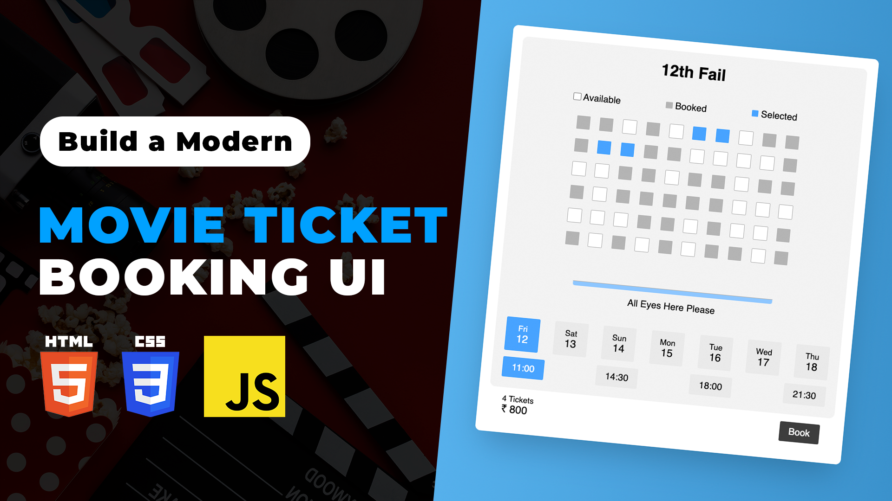

# Movie Seat Booking App | Movie Ticket Booking UI using HTML CSS JavaScript | JavaScript Beginner Projects

The Movie Seat Booking App is a beginner-friendly project that teaches JavaScript fundamentals by creating a simple and interactive movie ticket booking UI. With HTML, CSS, and JavaScript, learners can build a visually appealing interface where users can select seats and calculate the total ticket price, making it an ideal project for those starting their journey in web development.

Youtube Tutorial Link: https://youtu.be/3UTF-P7MkS0

